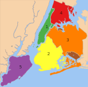

# New York City

**New York** (NYC) – often called New York City or the City of New York to distinguish it from the State of New York, of which it is a part – is the most populous city in the United States and the center of the New York metropolitan area, the premier gateway for legal immigration to the United States and one of the most populous urban agglomerations in the world. A global power city, New York exerts a significant impact upon commerce, finance, media, art, fashion, research, technology, education, and entertainment. Home to the headquarters of the United Nations, New York is an important center for international diplomacy and has been described as the cultural and financial capital of the world.

**Boroughs**

1) Manhattan (New York County) is the most densely populated borough and is home to Central Park and most of the city's skyscrapers. 
2) The Bronx (Bronx County) is New York City's northernmost borough, the location of Yankee Stadium, home of the New York Yankees, and home to the largest cooperatively owned housing complex in the United States, Co-op City. 
3) Brooklyn (Kings County), on the western tip of Long Island, is the city's most populous borough and was an independent city until 1898. 
4) Queens (Queens County), on Long Island east of Brooklyn, is geographically the largest borough, the most ethnically diverse county in the United States, as well as the most ethnically diverse urban area in the world. 
5) Staten Island (Richmond County) is the most suburban in character of the five boroughs. 

#### Demographics

<table>
	<tr><td>Racial composition</td><td>2010</td><td>1990</td><td>1970</td><td>1940</td><tr>
	<tr><td>White</td><td>44.0%</td><td>52.3%</td><td>76.6%</td><td>93.6%</td><tr>
	<tr><td>—Non-Hispanic</td><td>33.3%</td><td>43.2%</td><td>62.9%</td><td>92.0%</td><tr>
	<tr><td>Black or African American</td><td>25.5%</td><td>28.7%</td><td>21.1%</td><td>6.1%</td><tr>
	<tr><td>Hispanic or Latino (of any race)</td><td>28.6%</td><td>24.4%</td><td>16.2%</td><td>1.6%</td><tr>
	<tr><td>Asian</td><td>12.7%</td><td>7.0%</td><td>1.2%</td><td>−</td><tr>
</table>

New York City is the most-populous city in the United States, with an estimated record high of 8,491,079 residents as of 2014, incorporating more immigration into the city than outmigration since the 2010 United States Census. More people live in New York City than in the next two most-populous U.S. cities (Los Angeles and Chicago) combined. This amounts to about 40% of the state of New York's population and a similar percentage of the metropolitan regional population. In 2006, demographers estimated that New York's population will reach between 9.2 and 9.5 million by 2030.

Throughout its history, the city has been a major port of entry for immigrants into the United States; more than 12 million European immigrants were received at Ellis Island between 1892 and 1924. The term &quot;melting pot&quot; was first coined to describe densely populated immigrant neighborhoods on the Lower East Side. By 1900, Germans constituted the largest immigrant group, followed by the Irish, Jews, and Italians. In 1940, whites represented 92% of the city's population.

[Source:](http://en.wikipedia.org/wiki/New_York_City) [wikipedia.org](http://en.wikipedia.org/wiki/New_York_City)
